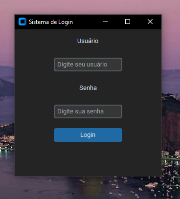

# 🔐 Sistema de Login em Python (Tkinter + CustomTkinter)

Este é um projeto simples de **tela de login** desenvolvido em **Python** utilizando a biblioteca **CustomTkinter** para criar uma interface moderna e estilizada no modo escuro.

Se desejar veja o mesmo projeto desenvolvido com **Java** e **JavaFX**: [Sistema de Login em JavaFX](https://github.com/pitercoding/tela-de-login-javafx)

## 🚀 Funcionalidades

- Interface gráfica moderna com **CustomTkinter**
- Campos de entrada para **usuário** e **senha**
- Validação simples de login com feedback visual:
  - ✅ “Login Sucessful!” em verde quando correto  
  - ❌ “Login Failed!” em vermelho quando incorreto  

## 🖥️ Demonstração

Ao executar o programa, será exibida uma janela como esta:



## ⚙️ Tecnologias Utilizadas

- [Python 3.10+](https://www.python.org/)
- [CustomTkinter](https://github.com/TomSchimansky/CustomTkinter)

## 📦 Instalação

1. **Clone o repositório**
   ```bash
   git clone https://github.com/pitercoding/tela-de-login-python.git
   cd tela-de-login-python
   ```
2. **Crie um ambiente virtual** (opcional, mas recomendado)
    ```bash
    python -m venv venv
    source venv/bin/activate     # Linux / macOS
    venv\Scripts\activate        # Windows
    ```
3. **Instale as dependências**
    ```bash
    pip install customtkinter
    ```
4. **Execute o projeto**
    ```bash
    app.py
    ```
   
## 🔑 Credenciais de Teste

Use as seguintes credenciais para testar o sistema:
```bash
    Usuário: piter
    Senha: 123456
```

## 📁 Estrutura do Projeto
```bash
    tela-de-login-python/
    │
    ├── app.py               # Código principal da aplicação
    ├── .gitignore            # Arquivos ignorados pelo Git
    └── README.md             # Este arquivo
```

## 🧠 Aprendizados

Este projeto foi criado com o objetivo de praticar:

- 🛠️ Criação de interfaces gráficas com **Tkinter**
- 🎨 Uso do **CustomTkinter** para uma estilização moderna
- 🔐 Estrutura básica de um **sistema de autenticação**

## 📜 Licença

Este projeto está sob a licença **MIT** — sinta-se à vontade para usar, estudar e modificar.

## 👤 Autor

**Piter Gomes**

📧 **E-mail:** [piterg.bio@gmail.com](mailto:piterg.bio@gmail.com)  
💼 **LinkedIn:** [linkedin.com/in/piter-gomes-4a39281a1](https://www.linkedin.com/in/piter-gomes-4a39281a1/)  
💻 **GitHub:** [github.com/pitercoding](https://github.com/pitercoding)  
🌐 **Portfólio:** [portfolio-pitergomes.vercel.app](https://portfolio-pitergomes.vercel.app/)

---
